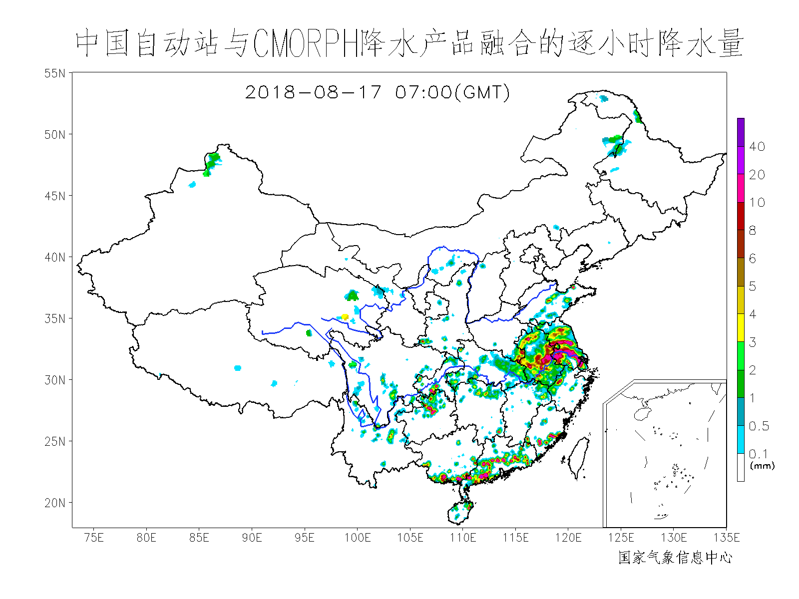

# Python3.读取二进制文件数据的一次实践

> 读取中国气象数据网的一个降水产品的二进制文件数据

一个名为`中国自动站与CMORPH降水产品融合的逐时降水量网格数据集（1.0版）`的数据产品，[官网](http://data.cma.cn/data/cdcdetail/dataCode/SEVP_CLI_CHN_MERGE_CMP_PRE_HOUR_GRID_0.10.html)提供了用GrADS读取的.ctl文件，但是我没装也不会GrADS，就有了这次实践。

## 分析

虽然不会GrADS，但根据提供的.ctl文件：
```
DSET ^SEVP_CLI_CHN_MERGE_FY2_PRE_HOUR_GRID_0.10-%y4%m2%d2%h2.grd
*
UNDEF -999.0
*
OPTIONS   little_endian  template
*
TITLE  China Hourly Merged Precipitation Analysis
*
xdef  700 linear  70.05  0.10
*
ydef  440 linear  15.05  0.10 
*
ZDEF     1 LEVELS 1  
*
TDEF 9999 LINEAR 00Z01Aug2010 1hr 
*
VARS 2                           
crain      1 00  CH01   combined analysis (mm/Hour)
gsamp      1 00  CH02   gauge numbers
ENDVARS
```

可直接获得信息：
- 存储方式是小端存储
- 空间范围为：70.05°E~139.95°E，15.05°N~58.95°N，间隔0.1°
- 有两个变量：降雨量`crain`和雨量计数量`gsamp`

可推测而得的信息：
- 结合文件的大小为2464000字节，可推测每个数据为`2464000/(700*440*2)`=4字节
- 结合示例图图例可知数据应该是浮点数（文档中没有找到数据类型的描述）

# 实现

读取该产品数据的函数如下：

```python
import numpy as np


def read(filename):
    """
    Args:
        filename: 文件名
        
    Returns:
        crain: 降水量mm <numpy.ndarray>
        gsamp: 雨量计数量 <numpy.ndarray>
    """
    data = np.fromfile(filename, dtype="<f4")
    data = data.reshape((880, 700), order='C')[::-1]
    gsamp = data[:440]
    crain = data[440:]
    return crain, gsamp
```

需要注意的是：
- 经过尝试，数组存储顺序是右侧为先（C-like）
- 数据的存储顺序是自西向东、自南向北、自`crain`向`gsamp`，直接读取时矩阵为上南下北，为了方便绘图等操作已经按习惯调整为上北下南

将读取的绘制出来与官网提供的gif对比如下：





---

Python的标准库`struct`就可以读取二进制数据，而当数据是整齐的矩阵时，`numpy`的`.fromfile()`方法可以直接读取成`<numpy.ndarray>`，方便后续的处理。

其实出图花了我一天的时间研究matplotlib很多细节，好想整理出来啊，但是我好~懒~啊~，下次吧。这次先贴下出图的源码：
```Python
import matplotlib.pyplot as plt
import matplotlib.transforms as mtransforms
import matplotlib as mpl
import cartopy.crs as ccrs
import cartopy.io.shapereader as shpreader
from cartopy.mpl.ticker import LongitudeFormatter, LatitudeFormatter
from matplotlib.font_manager import FontProperties

filename = (r"..\data\SURF_CLI_CHN_MERGE_CMP_PRE_HOUR_GRID_0.10"
            r"\surf_cli_chn_merge_cmp_pre_hour_grid_0.10"
            r"SURF_CLI_CHN_MERGE_CMP_PRE_HOUR_GRID_0.10-2018081707.grd")
crain, gsamp = read(filename)
crain[crain==-999] = np.nan

shpname = r"..\data\map\China_province"
provinces_records = list(shpreader.Reader(shpname).records())
provinces_geometrys = [x.geometry for x in provinces_records]

font = FontProperties(fname=r"C:\Windows\Fonts\simsun.ttc")
PlateCarree = ccrs.PlateCarree()
fig = plt.figure("Demo", figsize=(9, 6), dpi=100, constrained_layout=True)
ax = plt.axes(projection=PlateCarree)
ax.add_geometries(provinces_geometrys, PlateCarree,
                    edgecolor="gray", facecolor='None')
extent=[70.05, 139.95, 15.05, 59.95]
cmap = mpl.colors.ListedColormap(["cyan", "darkcyan",
                                    "green", "lime",
                                    "yellow", "gold", "goldenrod",
                                    "darkred", "brown", "red",
                                    "darkviolet"])
cmap.set_over("indigo")
cmap.set_under('white')
bounds = [0.1, 0.5, 1, 2, 3, 4, 5, 6, 8, 10, 20, 40]
norm = mpl.colors.BoundaryNorm(bounds, cmap.N)
im = ax.imshow(crain, transform=PlateCarree, origin='upper',
                extent=[70, 139.95, 15, 59.95],
                cmap=cmap, norm=norm, aspect=1.2)
cb = fig.colorbar(im, ax=ax, extend="both", extendrect=True, ticks=bounds,
                    extendfrac="auto", pad=0.01, shrink=0.8,
                    aspect=40, fraction=0.01)
cb.set_label("mm")
ax.set_xlim((72, 135))
ax.set_ylim((18, 55))
ax.set_xticks(list(range(75, 136, 5)), PlateCarree)
ax.set_yticks(list(range(20, 56, 5)), PlateCarree)
lon_formatter = LongitudeFormatter(zero_direction_label=True)
lat_formatter = LatitudeFormatter()
ax.xaxis.set_major_formatter(lon_formatter)
ax.yaxis.set_major_formatter(lat_formatter)
ax.set_title("中国自动站与CMORPH降水产品融合的逐小时降水量", fontproperties=font,
                fontsize=23)
plt.text(1, -0.07, "公众号 碎积云", fontproperties=font, transform=ax.transAxes,
            horizontalalignment="right", verticalalignment="top", fontsize=14)
plt.text(0.5, 0.98, "2018-08-17 07:00(GMT)", fontproperties=font,
            transform=ax.transAxes, horizontalalignment="center",
            verticalalignment="top", fontsize=15)
southsea = plt.imread(r"..\data\map\南海诸岛插图.tif")
y, x = southsea.shape[:2]
ax.imshow(southsea, origin='upper', extent=[135-10, 135, 18, 18+10/x*y],
            aspect=1.2)
plt.show()
plt.savefig(r"..\data\SURF_CLI_CHN_MERGE_CMP_PRE_HOUR_GRID_0.10\demo.png")
```

**<center><font color=lime>喜欢的话请关注吧，天晓得还会更新什么好玩儿的东西：</font></center>**

<center>

</center>